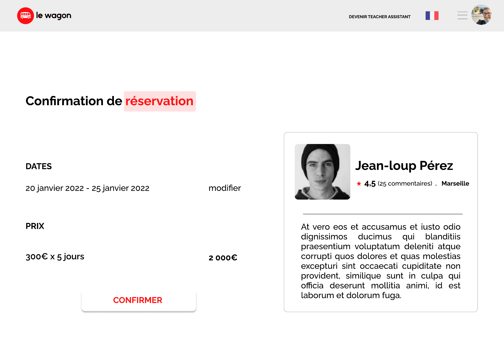
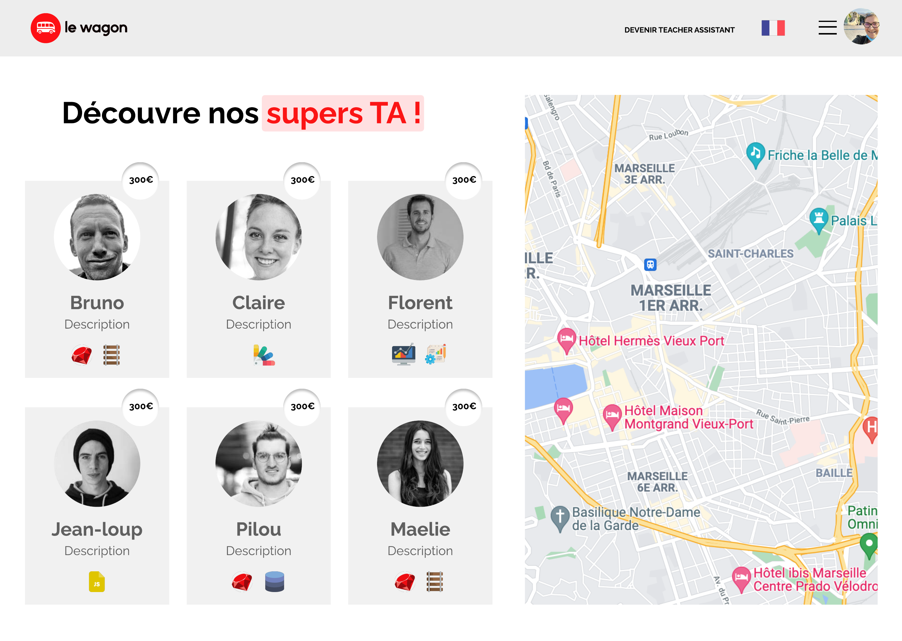
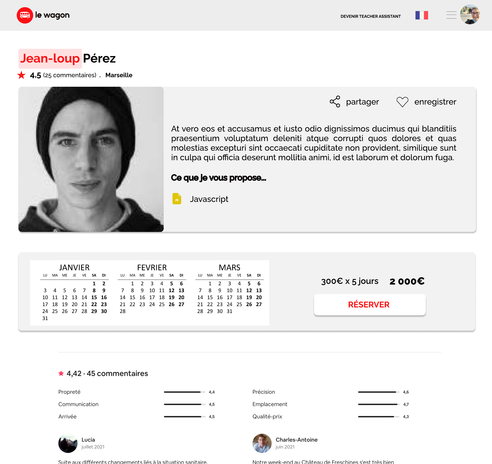
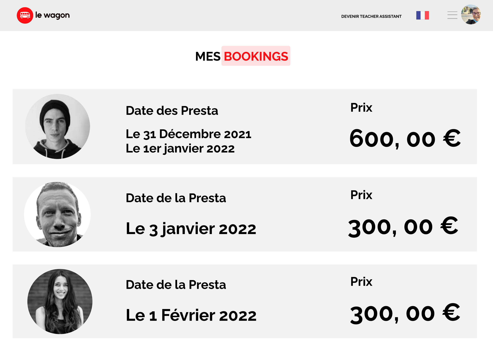
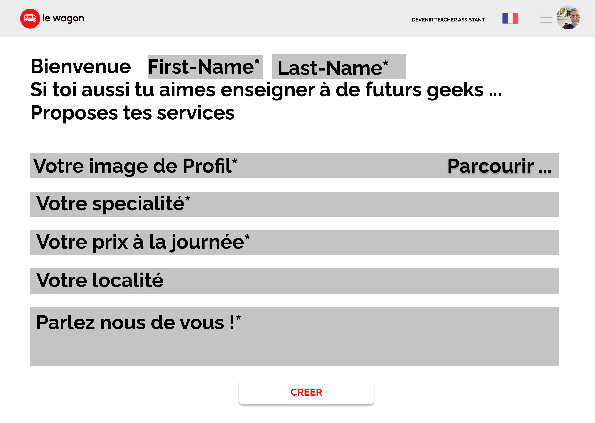
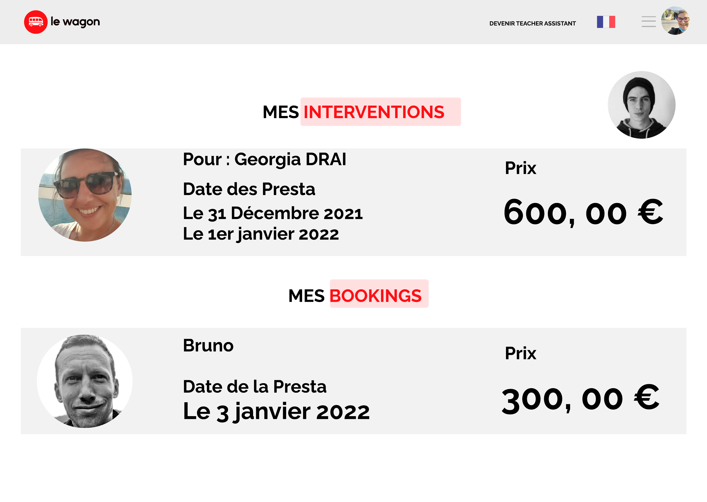

Rails app generated with [lewagon/rails-templates](https://github.com/lewagon/rails-templates), created by the [Le Wagon coding bootcamp](https://www.lewagon.com) team.
<h1 align="center">📚 BOOK_YOUR_TA – Le AirBnB des profs débordés 👨‍🏫</h1>

  Projet réalisé dans le cadre du <strong>bootcamp Le Wagon – Batch #776</strong> 
  🌟 Parce qu'on avait souvent besoin d'un prof... mais pas toujours un prof de dispo !

---

## 🧠 Le concept

BOOK_YOUR_TA est une appli de réservation... mais pas pour des logements 🏡  
Ici, on réserve un **Teacher Assistant (TA)** !  
Un clin d’œil à notre quotidien de bootcampeurs où, face à nos bugs, un prof surbooké devait courir de ticket en ticket.  
On s’est donc dit : *“Et si on en faisait une marketplace ?”* 😄

---

## ✨ Fonctionnalités principales

- 🔍 Recherche de TAs par ville
- 🗓 Réservation d’un créneau d’aide
- 💬 Système de commentaires
- 👤 Page profil pour chaque TA
- 📷 Avatar custom (fun assuré !)
- 🎭 Logique de rôles : User & TA

---

## 🛠️ Stack technique

- **Ruby on Rails** – back-end solide et MVC friendly
- **PostgreSQL** – pour stocker les bugs et les disponibilités 😅
- **Devise** – pour l’authentification
- **Bootstrap** – pour un design simple & responsive
- **Cloudinary + Active Storage** – pour les photos des super-profs 📸

---

## 👩‍💻 Mon rôle

J’ai occupé le rôle de **lead développeuse back-end** sur ce projet.  
J’ai notamment :

- mis en place la structure MVC,
- géré les modèles, les relations et les routes,
- intégré l’authentification avec Devise,
- collaboré activement avec l’équipe front-end.

---

## 📸 Aperçu
Notre interface a été pensée pour offrir une expérience simple, fluide et amusante.  
Voici quelques écrans extraits de la maquette Figma utilisée pour guider le développement de l'application :

---

### 🏠 Page d’accueil – Recherche par spécialité et ville

---

### 📅 Page de confirmation de réservation

---

### 👩‍🏫 Liste des TAs disponibles + carte interactive

---

### 📋 Profil d’un TA avec calendrier, compétences et tarif

---

### 🙋 Espace utilisateur – Mes réservations

---

### ✍️ Formulaire d’inscription – Devenir TA

---

### 🧾 Espace TA – Mes interventions passées

---

> 🧠 Cette maquette a été conçue pour **s’inspirer du fonctionnement d’Airbnb**, adaptée avec humour à notre réalité du Wagon : des tickets, des bugs, et beaucoup d’entraide.

## 🤝 L’équipe du chaos organisé

Projet réalisé en **2 à 3 semaines intensives**, dans une ambiance studieuse et joyeusement chaotique 🎢

| Nom & Avatar | Rôle |
|-------------|------|
|  [**Lilia Bekrar**](https://github.com/LiliaBekrar) | Lead développeuse back-end 🛠️ |
|  [**Maewenn Drean**](https://github.com/mdrean) | Lead développeuse front-end 🎨 |
|  [**Isabelle Douin**](https://github.com/IsaDou) | Développeuse back-end 🔧 |
|  [**Georgia Drai**](https://github.com/lumlum08) | Développeuse front-end 🎨 |
---

## 🤓 À propos

Projet du bootcamp [Le Wagon](https://www.lewagon.com), batch #776.  
Pensé pour rire, codé pour apprendre, livré avec fierté 💡

---

  Fabriqué avec ❤️, beaucoup de rires, et un soupçon de débrouillardise ✨

